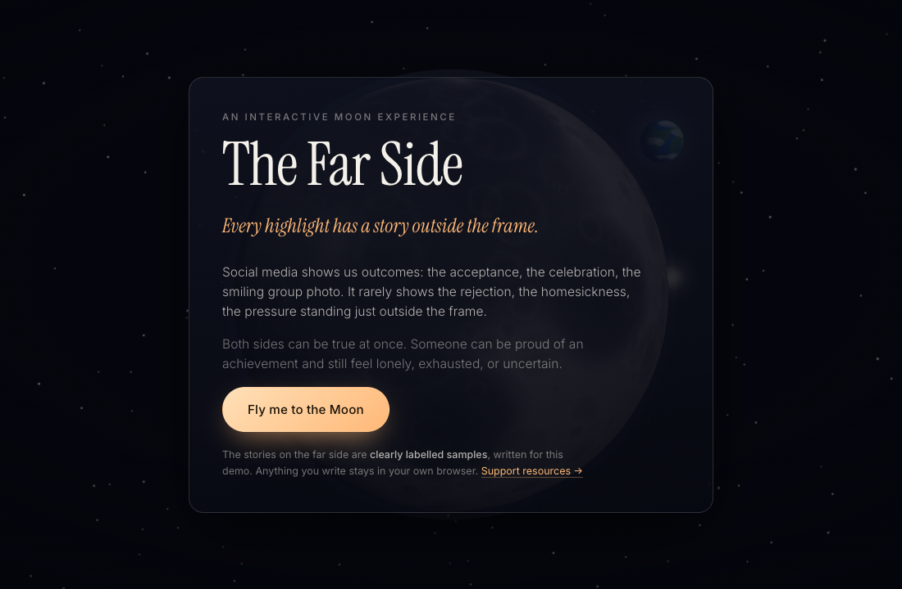
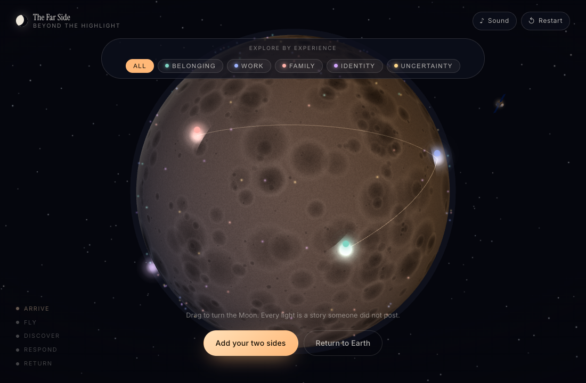

# The Far Side — Beyond the Highlight

**Every highlight has a story outside the frame.**

An interactive Moon experience about the feelings behind polished social media
moments. Visitors travel from a bright, post-filled side of the Moon to its far
side, where they can read anonymous two-sided stories, offer a quiet signal of
support through a lunar relay, and take one small act of connection back to
Earth.

The key idea: **both sides of a person's story can be true at once.** Someone can
be proud of an achievement and still feel lonely, exhausted, or uncertain.

| Bright side: the post | Far side: outside the frame |
| --- | --- |
| "I got the internship!" | "I was rejected 18 times first, and I was scared to tell anyone." |
| "Best first semester ever 🌙" | "I still haven't found people I feel close to." |
| "So grateful for my family ❤️" | "I'm helping care for someone at home, and I'm tired." |

All far-side stories shipped with the project are **clearly labelled samples**
written for the demo. Nothing a visitor writes leaves their browser.

| Arrive | The far side |
| --- | --- |
|  |  |

---

## The visitor journey

1. **Arrive — the highlight Moon.** A slowly rotating Moon fills the screen.
   Floating cards styled like a social feed drift over its bright face, with
   notification toasts and a busy, overlapping soundscape creating the sense of
   constant comparison.
2. **Fly — follow one story around the Moon.** Selecting a post asks *"What might
   be outside this frame?"* Choosing *See the other side* sends the camera around
   the lunar limb, carrying the post with it. Its polished image shrinks into a
   single point of light, the social sounds crossfade into a slow original chord,
   and the sun falls behind you. Mute and Skip are always available.
3. **Discover — the far side.** The post's light lands on the far side and opens
   its connected anonymous story. Hundreds of other lights are scattered across
   the surface. Stories can be filtered by broad experience — belonging, work,
   family, identity, uncertainty — so visitors can find something relevant
   without anyone collecting sensitive personal details.
4. **Respond — send a signal through the relay.** Instead of a like button, you
   send a short signal ("I hear you", "Thank you for sharing"). A beam travels
   from where you landed, up through an orbiting relay satellite, and down onto
   the story's light. Delivered signals leave faint strands behind, and those
   strands slowly build a **community constellation** across the Moon. There are
   no public popularity scores anywhere in the piece.
5. **Contribute and return.** Write your own two lines — what people might see,
   and what they might not — and keep it private or offer it for anonymous
   sharing. Then pick one small real-world action, with a copyable check-in
   message so the hardest part is already written.

> You never see someone's whole sky from one angle.

---

## Run it

There is **no build step and no dependencies to install.** The only requirement
is that the files are served over `http://` (ES modules and import maps do not
work from `file://`).

```bash
git clone https://github.com/<your-username>/the-far-side.git
cd the-far-side

python3 -m http.server 8000        # any static server works
# then open http://localhost:8000
```

Alternatives: `npx serve .`, `php -S localhost:8000`, or VS Code's *Live Server*.

**Requirements:** any current desktop or mobile browser with WebGL
(Chrome, Edge, Safari 16+, Firefox). Three.js is loaded from a CDN via an import
map, so the first load needs an internet connection.

### Deploy to GitHub Pages

The repo ships with `.github/workflows/deploy.yml`, which publishes the site on
every push to `main`. In your repository: **Settings → Pages → Build and
deployment → Source: GitHub Actions**. That's it — no build, the repo root is
the site.

---

## How it's built

Vanilla ES modules, [three.js](https://threejs.org) r161 via import map, the Web
Audio API, and CSS. No framework, no bundler, and no binary assets in the site
itself — the Moon and Earth textures are drawn into a `<canvas>` at load time
from a seeded PRNG, and every sound is synthesised in the browser. (The only
images in the repo are the README screenshots.)

```
index.html               markup for all seven screens
styles/
  base.css               tokens, stage, projected marker layer
  ui.css                 panels, feed cards, story panel, forms
src/
  main.js                journey orchestration and all wiring
  data/
    stories.js           the paired sample stories, themes, signals, copy
    actions.js           return-to-Earth actions + copyable messages
  moon/
    scene.js             Moon, lights, relay, flight, beams, constellation
    textures.js          procedural Moon and Earth textures
  audio/
    soundscape.js        two synthesised worlds and the crossfade between them
  ui/
    feed.js              bright-side feed cards + comparison toasts
    farside.js           filters, story panel, signal relay buttons
    contribute.js        the two-sided reflection form
    closing.js           return-to-Earth actions and clipboard
  lib/
    util.js              seeded PRNG, easing, lunar surface coordinates
    storage.js           localStorage — the only persistence layer
```

### Details worth knowing

- **Coordinates.** Longitude `0°` points at `-Z`, the centre of the far side.
  three.js' default sphere UVs put `-Z` at `u = 0.75`, so the right half of the
  generated texture is the far side and the left half is the maria-scarred near
  side. `surfacePoint(lat, lon)` in `lib/util.js` is the single source of truth.
- **The flight actually lands.** Before the camera swings around, the Moon is
  rotated so the selected story's longitude ends up facing the camera's final
  position, and the travelling post is slerped along a great circle in the
  Moon's local space — so it arrives exactly on its own light rather than near it.
- **Story lights are real buttons.** Each far-side story is a 3D sprite plus a
  DOM `<button>` projected onto it every frame, hidden when it rotates past the
  limb. So the far side is keyboard-navigable and screen-reader-visible. The
  ~220 ambient "other people" lights are GPU points with no DOM.
- **Earth is only visible from the near side.** It is a real object out past the
  limb; from the far side the Moon itself occludes it. That is the point.
- **`prefers-reduced-motion`** shortens the flight to ~2s, stills the drift
  animations, and shortens every tween.

## Privacy, and what this is not

- **No server, no analytics, no accounts, no network calls** other than the
  three.js and font CDNs. There is nothing to submit *to*.
- "Submit for anonymous sharing" is honest about this in the UI: it records your
  intent and saves the text in `localStorage` only. A real deployment would need
  moderation, rate limiting and a duty-of-care review before accepting a single
  real story — that is a policy problem, not a weekend coding problem.
- Everything you write can be deleted from the contribute panel, or by clearing
  site data.
- **This is an art piece, not a crisis service.** Nobody is monitoring what is
  typed here and nothing can reply. The experience links support resources
  (988 in the US/Canada, 116 123 in the UK/Ireland,
  [findahelpline.com](https://findahelpline.com) anywhere) from both the opening
  and closing screens.

## Credits

Concept, code and copy written for a hackathon on the theme *Fly Me to the Moon*.
Sample stories are fictional composites; no real person's words appear in this
repository.

## Licence

MIT — see [LICENSE](LICENSE).
